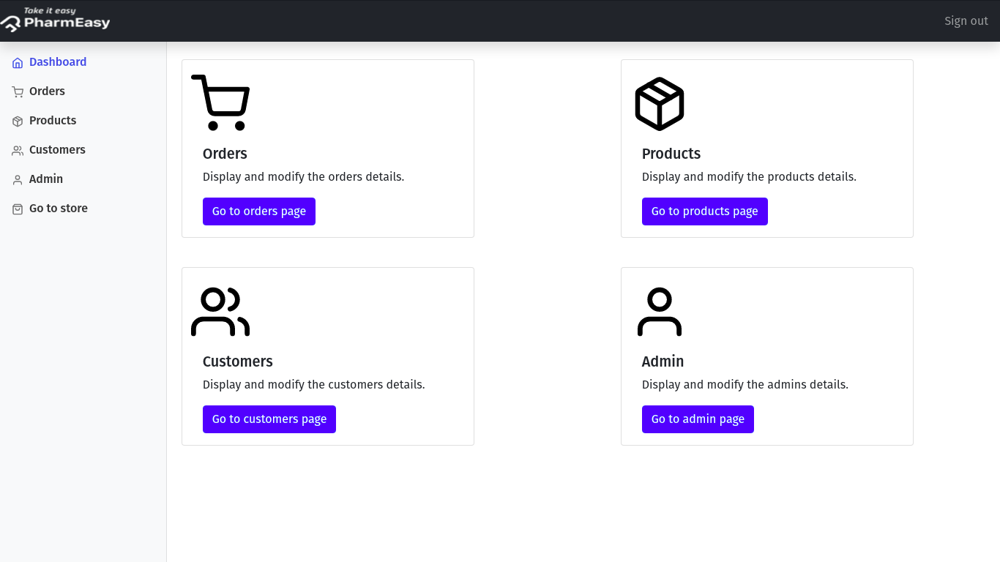

# 🌟 PharmaCare

**PharmaCare** is a digital platform designed to revolutionize the way pharmacies operate. From prescription medications to over-the-counter drugs, PharmaCare offers a convenient and reliable solution for purchasing medicines online, ensuring prompt and secure delivery to your doorstep. 

---

## ✨ Features

PharmaCare provides the following key functionalities:

1. **Register**: Create a user account to access the platform.
2. **Login**: Secure access to personalized services.
3. **Order**: Browse and order prescription or OTC medicines.
4. **Payment**: Hassle-free and secure payment gateway.
5. **Delivery**: Timely delivery of medicines to your location.

---

## 🧑‍💻 User Classes

### **1. User** 
- Customers who interact with the system.
- Provide necessary details for registration and orders.

### **2. Admin**
- Manages users and orders.
- Ensures segregation of client data for enhanced database security.

---

## 🌐 Tech Stack

### **Operating System**
- Ubuntu/Linux

### **Front-End**
- HTML
- CSS
- Bootstrap
- JavaScript

### **Back-End**
- SQL
- PHP

---

## 📸 Screenshots

### **Main Page**


The main page of PharmaCare serves as the starting point for users. It provides a user-friendly interface for navigation, allowing customers to easily search for medicines, view categories, and access their account. Key highlights include:
- Intuitive design for easy navigation.
- Quick access to featured and recommended medicines.

---

### **Product Details Page**


The product details page provides comprehensive information about each medicine, including:
- Name and description.
- Dosage details and instructions for use.
- Price and availability.
- An "Add to Cart" button for seamless ordering.

---

### **Admin Dashboard**


The admin dashboard is the control center for managing the platform. Key features include:
- A summary of user accounts and orders.
- Tools for adding, updating, or removing products.
- Detailed insights into order statuses and delivery tracking.
- Enhanced security to ensure data privacy.

---

## 🛠️ Installation & Setup

1. Clone the repository:
   ```bash
   git clone https://github.com/vyshu1440/PharmaCare.git
